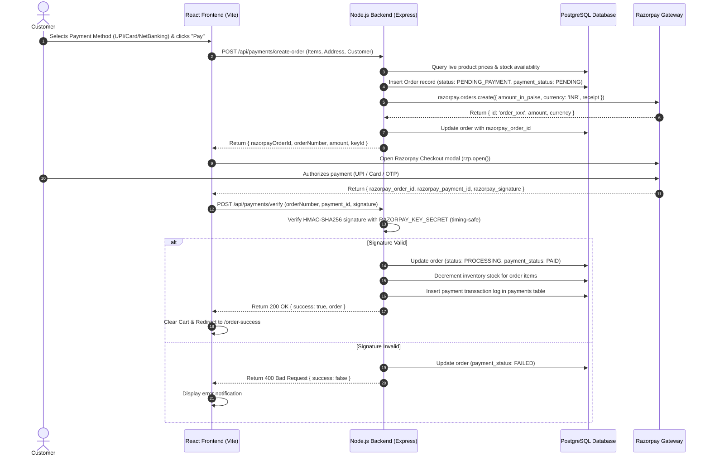

# MotorX - Razorpay Payment Gateway Integration Guide

Comprehensive documentation for the **Razorpay Payment Gateway** integration implemented in the **MotorX** full-stack e-commerce application.

---

## 1. Overview & Key Highlights

- **Official SDK Integration**: Built with the official `razorpay` Node.js SDK and Razorpay Checkout JS modal.
- **Server-Side Security**: Orders are priced and calculated directly on the server from PostgreSQL catalog records + 18% GST + dynamic shipping.
- **Timing-Safe Verification**: HMAC-SHA256 signature verification utilizes `crypto.timingSafeEqual` to prevent timing attacks.
- **Idempotent Inventory Control**: Stock is only deducted upon confirmed payment verification and protected against duplicate deductions.
- **Dual Payment Modes**: Seamlessly supports both **Online Razorpay (UPI, Credit/Debit Cards, NetBanking, Wallets, EMI)** and **Cash on Delivery (COD)**.
- **Zero Database Resets**: Non-destructive integration with complete preservation of products, orders, cart, wishlist, and admin credentials.

---

## 2. Architecture & Payment Lifecycle



---

## 3. Environment Variables Configuration

Create or update your `.env` file in the `backend/` directory:

```env
# Server Port
PORT=5000

# PostgreSQL Database Configuration
PGHOST=localhost
PGPORT=5432
PGDATABASE=Motorx
PGUSER=postgres
PGPASSWORD=your_postgres_password

# JWT Authentication
JWT_SECRET=motorx_super_secret_jwt_key_2026

# Frontend URL
FRONTEND_URL=http://localhost:5173

# Razorpay Payment Gateway Credentials
# NOTE: Never expose RAZORPAY_KEY_SECRET to the client/frontend!
RAZORPAY_KEY_ID=rzp_test_YOUR_KEY_ID
RAZORPAY_KEY_SECRET=YOUR_KEY_SECRET
RAZORPAY_WEBHOOK_SECRET=YOUR_WEBHOOK_SECRET
```

---

## 4. Setting up Razorpay Test Mode

1. Sign in or register at [Razorpay Dashboard](https://dashboard.razorpay.com/).
2. Toggle the switch in the top navigation bar from **Live Mode** to **Test Mode**.
3. Go to **Settings** $\rightarrow$ **API Keys**.
4. Click **Generate Key** to generate a Test Key ID and Key Secret.
5. Copy the generated `Key ID` (`rzp_test_...`) and `Key Secret` into `backend/.env`.
6. Restart the backend server (`npm start` or `npm run dev`).

---

## 5. API Reference

### 5.1 Initialize Payment Order
- **Endpoint**: `POST /api/payments/create-order`
- **Access**: Public
- **Request Body**:
  ```json
  {
    "customer": {
      "fullName": "Ananya Sharma",
      "email": "ananya.sharma@example.com",
      "mobile": "9876543210"
    },
    "address": {
      "flat": "Flat 402, Aero Heights",
      "street": "Koramangala 8th Block",
      "area": "Near Sony World",
      "city": "Bengaluru",
      "state": "Karnataka",
      "pincode": "560095",
      "country": "India"
    },
    "shippingMethod": "standard",
    "paymentMethod": "upi",
    "items": [
      { "productId": 1, "quantity": 1 }
    ]
  }
  ```
- **Response (Online Payment)**:
  ```json
  {
    "success": true,
    "isCod": false,
    "message": "Razorpay order created successfully",
    "data": {
      "razorpayOrderId": "order_XXXXXXXXXXXXXX",
      "orderNumber": "MX17144372",
      "amount": 1522200,
      "amountInINR": 15222,
      "currency": "INR",
      "keyId": "rzp_test_XXXXXXXXXX",
      "customerName": "Ananya Sharma",
      "customerEmail": "ananya.sharma@example.com",
      "customerPhone": "9876543210"
    }
  }
  ```

---

### 5.2 Verify Payment Signature
- **Endpoint**: `POST /api/payments/verify`
- **Access**: Public
- **Request Body**:
  ```json
  {
    "orderNumber": "MX17144372",
    "razorpay_order_id": "order_XXXXXXXXXXXXXX",
    "razorpay_payment_id": "pay_YYYYYYYYYYYYYY",
    "razorpay_signature": "4a76c8c9...e6d23"
  }
  ```
- **Response**:
  ```json
  {
    "success": true,
    "message": "Payment verified and order confirmed successfully",
    "data": {
      "orderNumber": "MX17144372",
      "totalAmount": 15222,
      "status": "PROCESSING",
      "paymentStatus": "PAID"
    }
  }
  ```

---

### 5.3 Webhook Listener
- **Endpoint**: `POST /api/payments/webhook`
- **Header**: `x-razorpay-signature`
- **Events Handled**:
  - `payment.captured`: Confirms payment and updates order status.
  - `payment.failed`: Marks order payment as failed.

---

## 6. Testing Guide

### Test Card Credentials (Test Mode)
| Field | Value |
| :--- | :--- |
| **Card Number** | `4111 1111 1111 1111` |
| **Expiry Date** | Any future date (e.g. `12/28`) |
| **CVV** | `123` |
| **OTP** | `123456` |

### Test UPI Credentials
- **VPA**: `success@razorpay` (Simulates instant success)
- **VPA**: `failure@razorpay` (Simulates bank failure)

### Test NetBanking
- Select any listed test bank (e.g., **HDFC Bank**, **SBI**, **ICICI Bank**) and choose **Success** or **Failure** on the Razorpay simulation screen.

---

## 7. Database Tables

### `orders`
| Column | Type | Description |
| :--- | :--- | :--- |
| `id` | `INTEGER` | Primary key |
| `order_number` | `VARCHAR` | Unique customer order identifier (e.g. `MX17144372`) |
| `razorpay_order_id` | `VARCHAR` | Razorpay Order ID (`order_xxx`) |
| `razorpay_payment_id` | `VARCHAR` | Razorpay Payment ID (`pay_xxx`) |
| `razorpay_signature` | `VARCHAR` | HMAC-SHA256 signature |
| `payment_status` | `VARCHAR` | `PENDING`, `PAID`, `FAILED`, `PENDING_COD` |
| `status` | `VARCHAR` | `PENDING_PAYMENT`, `PROCESSING`, `SHIPPED`, `DELIVERED`, `CANCELLED` |
| `inventory_deducted` | `BOOLEAN` | Prevents double inventory deductions |

### `payments`
| Column | Type | Description |
| :--- | :--- | :--- |
| `id` | `INTEGER` | Primary key |
| `order_id` | `INTEGER` | Foreign key referencing `orders(id)` |
| `order_number` | `VARCHAR` | Associated order number |
| `razorpay_order_id` | `VARCHAR` | Razorpay Order ID |
| `razorpay_payment_id`| `VARCHAR` | Razorpay Payment ID |
| `amount` | `NUMERIC` | Paid amount in INR |
| `status` | `VARCHAR` | `CAPTURED`, `FAILED`, `REFUNDED` |
| `method` | `VARCHAR` | `upi`, `cards`, `netbanking`, `wallet` |

---

## 8. Transitioning to Live Production

1. Complete Razorpay Business KYC inside the [Razorpay Dashboard](https://dashboard.razorpay.com/).
2. Switch toggle to **Live Mode**.
3. Generate **Live API Keys** (`rzp_live_...`).
4. Update `RAZORPAY_KEY_ID` and `RAZORPAY_KEY_SECRET` in your production environment.
5. Add the Webhook endpoint URL (`https://yourdomain.com/api/payments/webhook`) under Razorpay Webhook settings.
